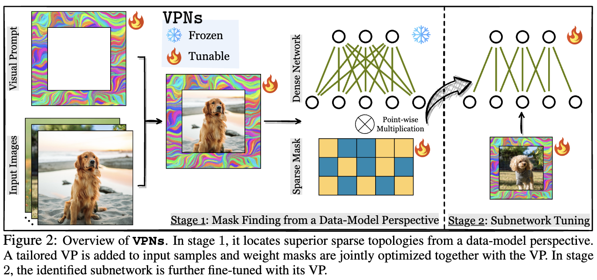

# Visual Prompting Upgrades Neural Network Sparsification: A Data-Model Perspective (VPNs)

<p align="left">
  <a href="https://opensource.org/licenses/MIT"></a>
</p>

Code for the paper [Visual Prompting Upgrades Neural Network Sparsification: A Data-Model Perspective]()

Authors: Can Jin, Tianjin Huang, Yihua Zhang, Mykola Pechenizkiy, Sijia Liu, Shiwei Liu, Tianlong Chen


# Overview

The rapid development of large-scale deep learning models questions the affordability 
of hardware platforms, which necessitates the pruning to reduce their computational 
and memory footprints. Sparse neural networks as the product, have demonstrated numerous 
favorable benefits like low complexity, undamaged generalization, _etc_. Most of the 
prominent pruning strategies are invented from a _model-centric_ perspective, focusing 
on searching and preserving crucial weights by analyzing network topologies. 
However, the role of data and its interplay with model-centric pruning has remained 
relatively unexplored. In this research, we introduce a novel _data-model co-design_ 
perspective: to promote superior weight sparsity by learning important model topology 
and adequate input data in a synergetic manner. Specifically, customized **V**isual 
**P**rompts are mounted to upgrade neural **N**etwork **s**parsification in our proposed </strong></code>VPNs</code></strong> 
framework. As a pioneering effort, this paper conducts systematic investigations about 
the impact of different visual prompts on model pruning and suggests an effective joint 
optimization approach. Extensive experiments with 3 network architectures and 8 datasets 
evidence the substantial performance improvements from </strong></code>VPNs</code></strong> over existing start-of-the-art 
pruning algorithms. Furthermore, we find that subnetworks discovered by </strong></code>VPNs</code></strong> from pre-trained 
models enjoy better transferability across diverse downstream scenarios. These insights 
shed light on new promising possibilities of data-model co-designs for vision model sparsification. 



# 1. Install requirements: 
```
conda create -n vpns python=3.8
conda activate vpns
pip install -r requirements.txt
```

# 2. Symlink datasets (Optional):

If you already have the datasets downloaded, create a symlink. If you skip this step, the datasets will be downloaded automatically.
```
mkdir ./dataset
ln -s <DATASET_PARENT_DIR> ./datasets
```

# 3. Run VPNs pruning

ResNet-18 on CIFAR100 at 40%, 50%, 60%, 70%, 80%, and 90% sparsity levels.
```
bash vpns_resnet18_cifar100.sh
```

ResNet-50 on Tiny-ImageNet at 40%, 50%, 60%, 70%, 80%, and 90% sparsity levels (need to put the data under `./dataset/tiny_imagenet/`).
```
bash vpns_resnet50_tiny_imagenet.sh
```

Please change the network and dataset in `vpns.sh` file to run more experiments.

# 4. Checkpoints

We provide some best checkpoints of VPNs pruning here.

| Network+Dataset | 40% sparsity | 60% sparsity | 70% sparsity |
| :----------: | :----------: | :----------: | :----------: |
| ResNet18+CIFAR10 | [ckpt](https://drive.google.com/file/d/1iONKgIyJf5XIqMIQDnreQgyzDfa4KyFh/view?usp=drive_link) | [ckpt](https://drive.google.com/file/d/1BFlW8VpStW0efzLI32hUZD16wl4cGIkP/view?usp=drive_link) | [ckpt](https://drive.google.com/file/d/1ZQlr-6_O2ehmPen1Uxold1Yb2hN-GfNM/view?usp=drive_link) |
| ResNet18+CIFAR100 | [ckpt](https://drive.google.com/file/d/1f8TTDDjChVSFIvre-V1wb5Y_PkIMr6cN/view?usp=drive_link) | [ckpt](https://drive.google.com/file/d/1ilrPZiN-We6ryWMlekJosBOH8H8-l9UT/view?usp=drive_link) | [ckpt](https://drive.google.com/file/d/13XcvYwiy2t1Rn2Qx6uB1iqvgwbUzvhNV/view?usp=drive_link) |
| ResNet18+Tiny-ImageNet | [ckpt](https://drive.google.com/file/d/1FmVS7GuWHahcCh5zoEZT5CWdKZnwUG1v/view?usp=drive_link) | [ckpt](https://drive.google.com/file/d/1vnXqzzoUwjhPuIOQCiF_YvcSlGTSHdnn/view?usp=drive_link) | [ckpt](https://drive.google.com/file/d/1WBu_-NSPs1Dhkmk0c_0r9MXTiU8-5N9X/view?usp=drive_link) |

# Citation
```bibtex
@article{example2021,
  title={Example Title},
  author={Author, First and Coauthor, Second},
  journal={Journal Name},
  volume={1},
  number={1},
  pages={1--10},
  year={2021},
  publisher={Publisher}
}
